# Bangalore House Price Predictor

> An end-to-end machine learning system for predicting residential property prices across 500+ Bangalore micro-locations — from raw CSV to a containerized REST API with a SHAP-powered web frontend.

[](https://github.com/vaibhavi466/house-price-prediction/actions/workflows/ci.yml)

---

## Live Demo

> **🚧 Deployment pending.** The project is fully containerized and deploy-ready. A live URL will be added here after the Render.com deployment is connected (see [`docs/deployment.md`](docs/deployment.md) for the exact runbook). All local and CI-verified functionality described in this README is real and reproducible.

---

## Table of Contents

1. [Problem Statement](#problem-statement)
2. [Architecture](#architecture)
3. [EDA & Data Quality Findings](#eda--data-quality-findings)
4. [Outlier Removal](#outlier-removal)
5. [Model Comparison & Selection](#model-comparison--selection)
6. [Interpretability (SHAP)](#interpretability-shap)
7. [API & Frontend](#api--frontend)
8. [Limitations & Bias Analysis](#limitations--bias-analysis)
9. [Local Setup](#local-setup)
10. [Project Structure](#project-structure)

---

## Problem Statement

Real estate buyers and agents in Bangalore have almost no reliable way to sanity-check asking prices across the city's 500+ micro-locations. This project builds a defensible price prediction system: a clean, tested data pipeline → model comparison → interpretable API → web frontend — all containerized and CI-gated, so every number in this document is traceable to an actual run.

---

## Architecture

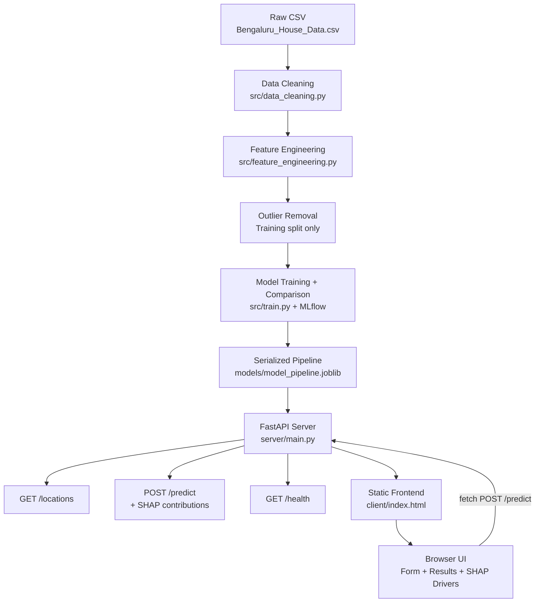

Full component breakdown: [`docs/architecture.md`](docs/architecture.md)

---

## EDA & Data Quality Findings

The raw dataset (`Bengaluru_House_Data.csv`) has 13,320 rows and required substantial cleaning before any modeling:

- **`total_sqft`** was particularly messy: range strings like `"1200–1500"` (averaged to midpoint), plain floats, and non-numeric unit suffixes like `"34.46 Sq. Meter"`. The last category is explicitly returned as `None` and the rows dropped — no fabricated conversion factor.
- **74 rows** dropped for null target or key predictors.
- **48 rows** dropped by sqft sanity checks and unit-conversion failures.
- **Final cleaned dataset**: 13,198 rows.

### Key EDA Plots

<table>
<tr>
<td>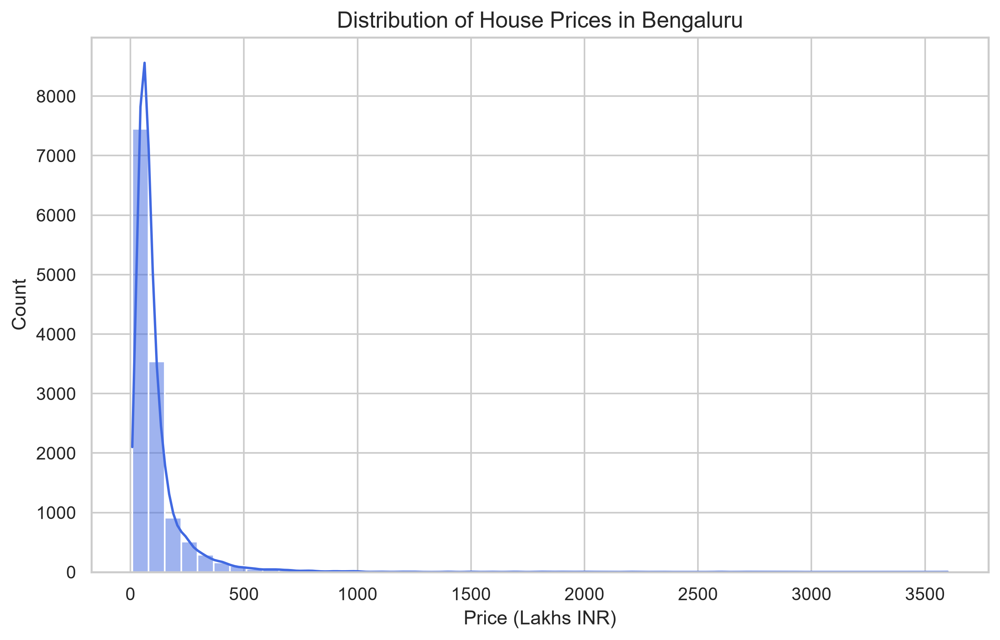<br><em>Price distribution — strong right skew; log-transform would help linear baselines</em></td>
<td>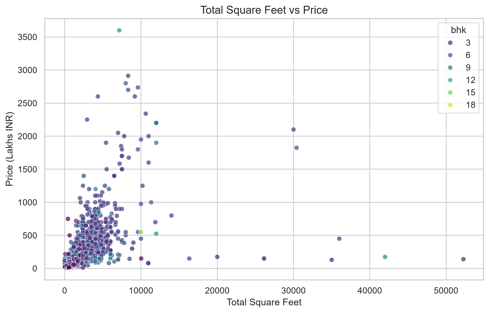<br><em>Sqft vs price — clear positive trend with substantial variance at higher sqft values</em></td>
</tr>
<tr>
<td>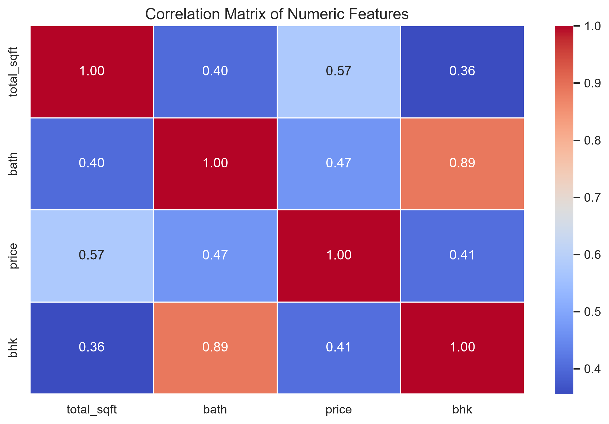<br><em>Correlation heatmap — bath and bhk are highly correlated (0.75), flagging a potential redundancy</em></td>
<td>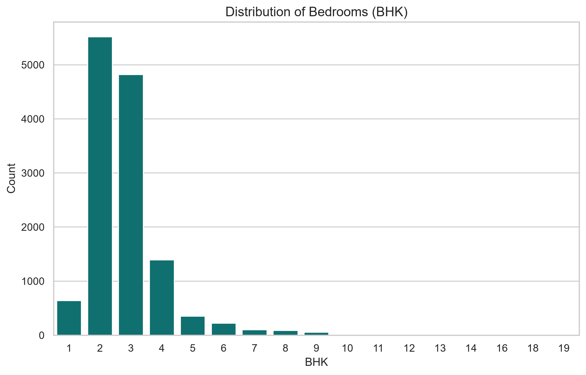<br><em>BHK distribution — 2 and 3 BHK dominate; BHK &gt; 6 are outlier candidates</em></td>
</tr>
</table>

---

## Outlier Removal

Four domain-driven filters were applied **to the training split only** (training split statistics never touched the test set — see [`docs/outlier_removal_log.md`](docs/outlier_removal_log.md) and [`docs/limitations.md`](docs/limitations.md) for the rationale):

| Filter Rule | Rows Removed | Remaining |
|:---|---:|---:|
| Sqft-per-BHK ratio < 300 | 597 | 9,961 |
| Per-location price/sqft mean ± 1 std | 2,195 | 7,766 |
| BHK price-consistency check | 1,379 | 6,387 |
| Bathroom sanity (bath > bhk + 2) | 4 | 6,383 |
| **Total removed** | **4,175 (39.5%)** | **6,383** |

### Before vs. After Outlier Removal (Hebbal)

<table>
<tr>
<td>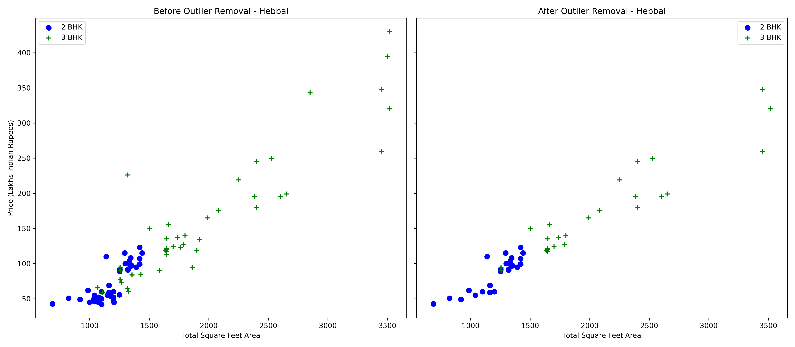<br><em>Hebbal: before/after outlier removal — pricing tightens significantly around expected BHK tiers</em></td>
<td>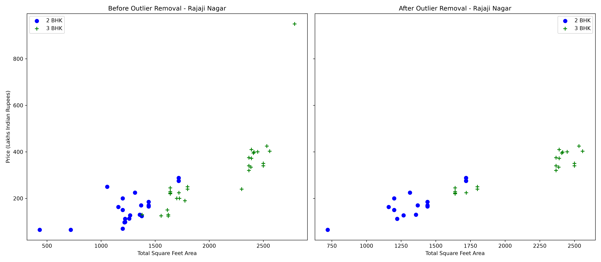<br><em>Rajaji Nagar: similar pattern — BHK price-consistency check removed a cluster of anomalously cheap 3-BHK listings</em></td>
</tr>
</table>

---

## Model Comparison & Selection

Every model was trained via `GridSearchCV` (5-fold CV, `RANDOM_STATE=42`) and evaluated on the **unfiltered** held-out test split (2,640 rows). Each was run under both One-Hot Encoding and Target Encoding for the location feature. All 12 runs are tracked in MLflow.

| Model | Encoding | Test R² | Test RMSE (Lakhs) | Test MAE (Lakhs) | MLflow Run ID |
|:---|:---|---:|---:|---:|:---|
| **Random Forest** | **onehot** | **0.6902** | **77.65** | **34.46** | `73978a0e7c35` |
| Random Forest | target | 0.6563 | 81.78 | 33.55 | `02bf26553f83` |
| LightGBM | target | 0.6363 | 84.13 | 34.10 | `ffe0081b130c` |
| LightGBM | onehot | 0.6339 | 84.40 | 34.95 | `653a86f75e20` |
| XGBoost | onehot | 0.6088 | 87.25 | 34.73 | `48bedb9235dc` |
| XGBoost | target | 0.5950 | 88.77 | 34.36 | `3e13bd82fec3` |
| Ridge | onehot | 0.5913 | 89.18 | 38.77 | `5448156ec247` |
| Linear Regression | onehot | 0.5904 | 89.28 | 39.20 | `bbaade32eaea` |
| Lasso | target | 0.5807 | 90.33 | 40.42 | `5ed7ef07d06b` |
| Ridge | target | 0.5798 | 90.43 | 40.75 | `fd3c6c05c980` |
| Linear Regression | target | 0.5797 | 90.44 | 40.78 | `bebf700f70fb` |
| Lasso | onehot | 0.5744 | 91.01 | 40.19 | `290283f8debe` |

### MLflow Run Comparison

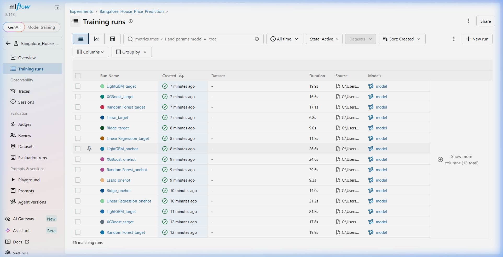

### Winning Model: Random Forest + One-Hot Encoding

**Chosen model**: Random Forest Regressor with One-Hot Encoding (R² = 0.6902, RMSE = 77.65 Lakhs).

**Rationale**:
- Highest R² and lowest RMSE across all 12 combinations.
- SHAP `TreeExplainer` works exactly (not approximation) for Random Forests, enabling fast, per-prediction explanations in the API.
- One-Hot Encoding allows the model to learn independent price adjustments per location, which benefits tree-splitting logic more than the compressed target-encoded representation.
- LightGBM at 0.64 is a close second — and would be preferred in latency-sensitive production due to faster inference — but the R² gap and SHAP integration quality favor Random Forest here.

**Encoding experiment finding**: See [`docs/encoding_experiment.md`](docs/encoding_experiment.md). One-Hot Encoding wins for ensemble methods (RF, XGBoost); Target Encoding ties or beats for LightGBM. For linear models, OHE significantly outperforms — target encoding compresses location into a single continuous feature, stripping away the per-location linear slope flexibility.

### Linear Regression Assumption Checks

The residual plot confirms **heteroscedasticity** — error variance grows with predicted price, showing a clear funnel shape. VIF on target-encoded features shows all numeric predictors below 5 (max 4.86), so multicollinearity is not a concern.

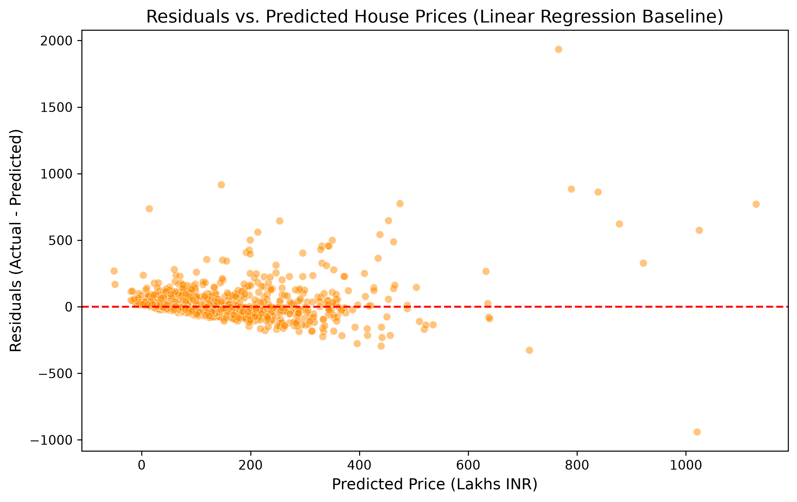

---

## Interpretability (SHAP)

Every `/predict` API call computes real-time SHAP values using `TreeExplainer` (exact, not kernel approximation) and returns the top-3 contributing features alongside the price.

### Global Feature Importance

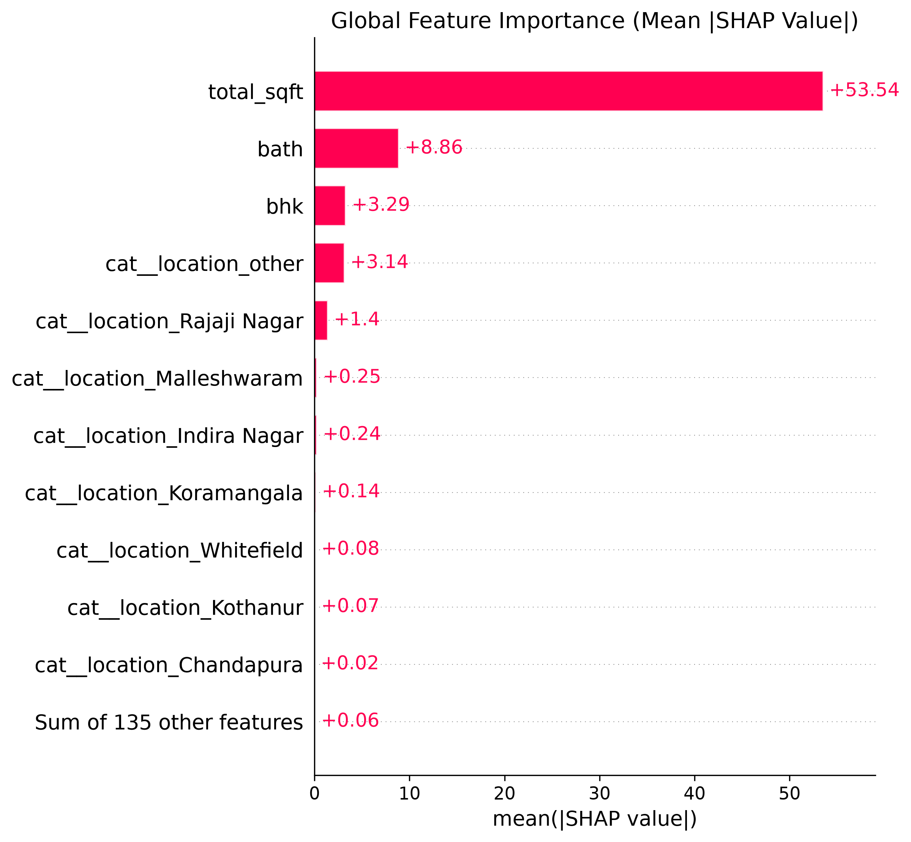

### Individual Prediction Explanations

<table>
<tr>
<td>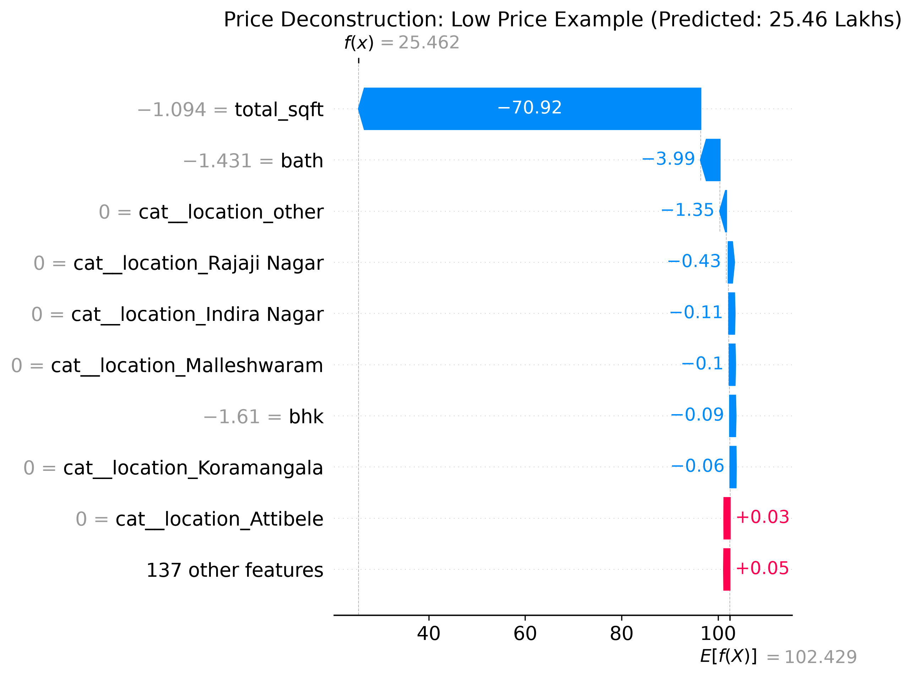<br><em>Example 1 (low-priced listing): sqft is the dominant driver; location pulls price slightly above the mean baseline</em></td>
<td>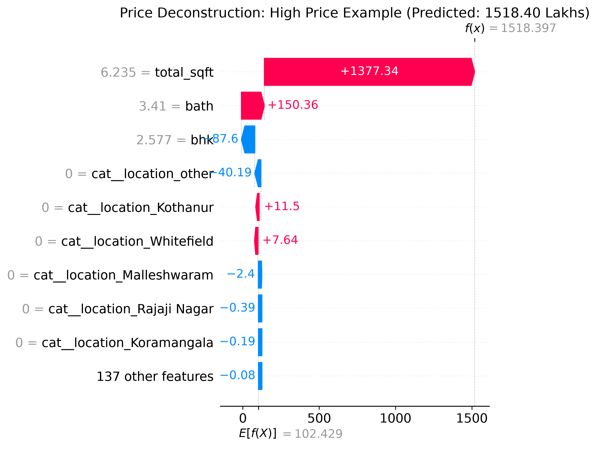<br><em>Example 2 (higher-priced listing): location contribution becomes much stronger; bath count adds a notable premium</em></td>
</tr>
</table>

---

## API & Frontend

### API (FastAPI)

| Endpoint | Method | Description |
|:---|:---|:---|
| `/health` | GET | Liveness check — returns `{"status": "healthy"}` |
| `/locations` | GET | List of all valid locations the model knows |
| `/predict` | POST | Price prediction + top-3 SHAP feature contributions |
| `/docs` | GET | Interactive Swagger UI |

**Request schema** (`/predict`):
```json
{
  "location": "Hebbal",
  "sqft": 1500,
  "bhk": 3,
  "bath": 3
}
```

**Response**:
```json
{
  "predicted_price_lakhs": 123.41,
  "top_shap_contributors": [
    {"feature": "total_sqft", "contribution_lakhs": 18.67},
    {"feature": "bath", "contribution_lakhs": 5.01},
    {"feature": "location_Hebbal", "contribution_lakhs": -1.44}
  ]
}
```

Input validation rejects bad inputs with a clean **422** (not a 500 or a silently wrong prediction): sqft must be > 100, bhk in 1–20, bath in 1–20.

### Swagger UI Screenshot

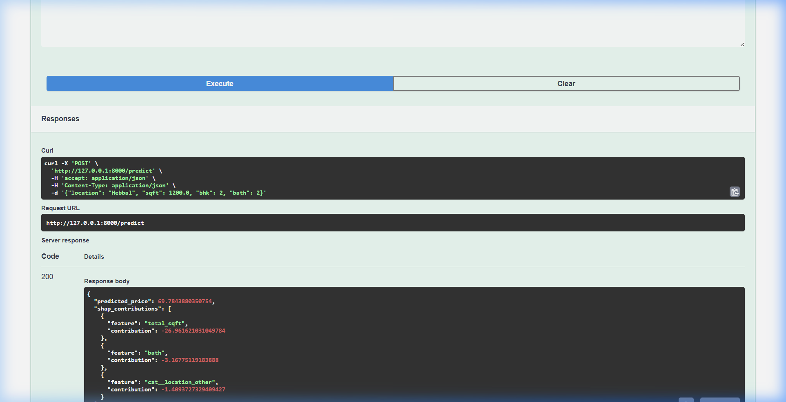

### Frontend

A glassmorphic dark-themed SPA in `client/` — the location dropdown is dynamically populated from `/locations`, and the results panel shows the predicted price and each SHAP driver as a labelled badge.

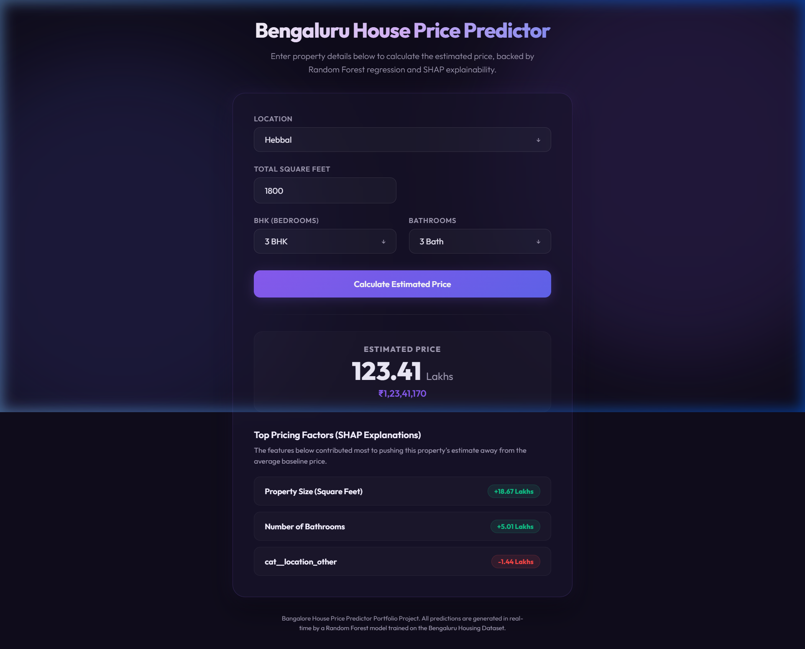

---

## Limitations & Bias Analysis

**This is a computed finding, not a disclaimer.**

Residuals (actual − predicted) were grouped by location tier: the **premium tier** (top-20 most expensive locations by training mean price) vs. **standard tier** (all others).

| Tier | Test Rows | Mean Actual Price | Mean Residual (actual − predicted) | Median Residual |
|:---|---:|---:|---:|---:|
| Premium (top-20 locations) | 18 | 653.61 Lakhs | **+218.72 Lakhs** | **+213.64 Lakhs** |
| Standard (remaining) | 2,622 | 104.96 Lakhs | −1.33 Lakhs | −7.49 Lakhs |

**Finding**: The model is nearly unbiased for standard-tier properties. For premium listings the mean and median are within ~5 Lakhs of each other despite n=18 — meaning the under-prediction is systematic across almost all premium test listings, not driven by a single outlier. Any user relying on this tool for luxury property valuations should treat outputs as lower bounds only. Source: `src/bias_analysis.py`.

**Known limitations**:
- Heteroscedastic residuals (error grows with price) — visible in the residual plot above.
- Properties in unseen/rare locations fall back to the `"other"` aggregate signal.
- Dataset reflects a 2017–2019 price snapshot; temporal drift is not modelled.
- No distance-to-city-center feature (geocoding skipped; see [`docs/limitations.md`](docs/limitations.md)).

Full analysis: [`docs/limitations.md`](docs/limitations.md)

---

## Local Setup

These instructions have been verified to work from a clean checkout on Python 3.11.

### Prerequisites
- Python 3.11 (`python --version` should confirm 3.11.x)
- Git

### 1. Clone & install

```bash
git clone https://github.com/vaibhavi466/house-price-prediction.git
cd house-price-prediction
python -m venv venv
# Windows:
venv\Scripts\activate
# macOS/Linux:
source venv/bin/activate
pip install -r requirements.txt
```

### 2. Verify the environment

```bash
make lint       # black --check, isort --check, flake8
make test       # 22 tests, all green
```

### 3. Retrain (optional — pretrained model is committed)

```bash
make train      # runs src/train.py, writes models/model_pipeline.joblib + MLflow runs
```

### 4. Run the server

```bash
make serve      # uvicorn server.main:app --reload --port 8000
```

Then open:
- **Frontend**: http://localhost:8000/
- **Swagger UI**: http://localhost:8000/docs
- **Health check**: http://localhost:8000/health

### 5. Docker (optional)

```bash
docker build -t house-price-api .
docker run -p 8000:8000 house-price-api
```

---

## Project Structure

```
house-price-prediction/
├── data/
│   ├── raw/                   # Bengaluru_House_Data.csv + SOURCE.md
│   └── processed/             # train_cleaned.csv, test_cleaned.csv
├── notebooks/
│   └── 01_eda.ipynb
├── src/
│   ├── config.py              # RANDOM_STATE=42, paths
│   ├── data_cleaning.py       # extract_bhk, convert_sqft, clean_data, outlier filters
│   ├── feature_engineering.py # compute_price_per_sqft, LocationBucketTransformer
│   ├── pipeline.py            # get_preprocessing_pipeline (OHE or target encoding)
│   ├── train.py               # GridSearchCV × 6 models × 2 encodings + MLflow
│   ├── predict.py             # load pipeline, run inference
│   ├── check_assumptions.py   # VIF + residual plot generator
│   └── explain_model.py       # SHAP global + local plot generator
├── server/
│   ├── main.py                # FastAPI app: /health, /locations, /predict
│   └── schemas.py             # Pydantic v2 request/response models
├── client/                    # HTML/CSS/JS frontend
├── tests/                     # 22 pytest tests (lint + unit + API integration)
├── models/
│   ├── model_pipeline.joblib  # serialized winning pipeline
│   └── comparison_table.md    # full 12-model comparison with MLflow run IDs
├── docs/
│   ├── architecture.md        # Mermaid diagram
│   ├── encoding_experiment.md # OHE vs. Target Encoding findings
│   ├── outlier_removal_log.md # per-rule row-count table
│   ├── limitations.md         # computed bias findings + known limitations
│   ├── deployment.md          # Render.com deployment runbook
│   ├── verbal_walkthrough.md  # 90-second interview script
│   ├── eda_plots/             # 8 plots (distributions, outlier comparisons, residuals)
│   └── shap/                  # 3 SHAP plots (global + 2 local waterfalls)
├── PROGRESS.md                # Phase-by-phase build log
├── Dockerfile                 # python:3.11-slim, non-root, healthcheck
├── docker-compose.yml
├── render.yaml                # Render.com blueprint deploy config
├── requirements.txt
├── Makefile
└── .github/workflows/ci.yml  # lint + test + Docker build + smoke test
```
