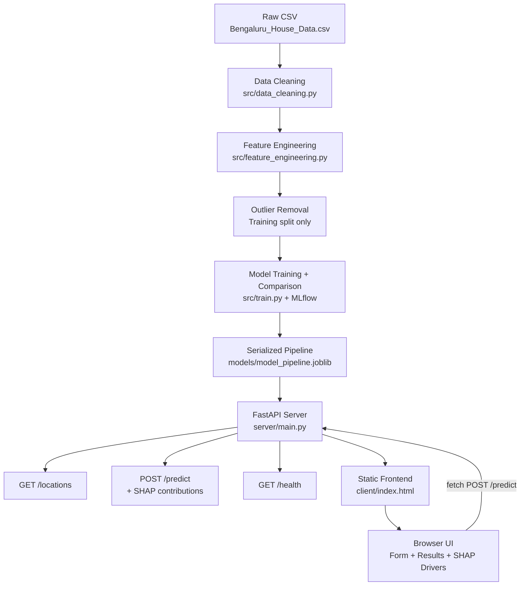

# Architecture

This document describes the end-to-end architecture of the Bangalore House Price Predictor.

## System Diagram

## Component Responsibilities

| Component | File(s) | Responsibility |
|:---|:---|:---|
| Data Cleaning | `src/data_cleaning.py` | Parse, clean, validate raw CSV. Drop bad rows. |
| Feature Engineering | `src/feature_engineering.py` | Location bucketing transformer (leakage-safe). |
| Outlier Removal | `src/data_cleaning.py` | 4-rule domain filter on training split only. |
| ML Pipeline | `src/pipeline.py` | ColumnTransformer: scale numerics, encode location. |
| Model Training | `src/train.py` | GridSearchCV × 6 models × 2 encodings. MLflow tracking. |
| Prediction | `src/predict.py` | Load serialized pipeline, run inference. |
| API Server | `server/main.py` | FastAPI: /health, /locations, /predict + SHAP. |
| Frontend | `client/` | Vanilla HTML/CSS/JS SPA, fetches /locations and /predict. |
| Containerization | `Dockerfile` | python:3.11-slim, non-root user, healthcheck. |
| CI | `.github/workflows/ci.yml` | Lint + test + Docker build + smoke test on every push. |
